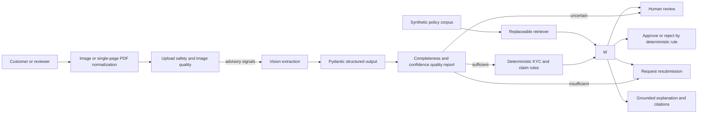

# Fin-Guardrail API

An AI-assisted KYC and medical-claim review workflow for Thai financial operations. The service extracts structured document fields with a vision model, applies deterministic risk rules, retrieves synthetic policy evidence, and routes the case through a bounded tool workflow. AI supports extraction and explanation; Python rules or a human retain authority over high-stakes outcomes.

## Why this exists

Onboarding and claims teams repeatedly inspect document quality, identity fields, invoice arithmetic, and policy exceptions. Fin-Guardrail automates the repeatable portions while making uncertainty, evidence, and escalation visible. It supports Thai national IDs and itemized medical receipts through a FastAPI API and review UI.

## Architecture



Image blur and processed dimensions are advisory rather than automatic rejection rules. Structured extraction completeness and confidence decide whether processing can continue, needs human confirmation, or needs a replacement document. The workflow accepts only allowlisted typed tools, caps attempts, strips free-form flag details from audit events, and fails closed to human review when validation or policy evidence is unavailable. Retrieval currently uses a deterministic lexical baseline; embeddings are intentionally deferred until evaluation demonstrates a need.

## Run locally

```bash
python -m venv .venv
source .venv/bin/activate
pip install -r requirements.txt
# macOS: brew install poppler
# Ubuntu/Debian: sudo apt-get install poppler-utils
cp .env.example .env
USE_MOCK_LLM=true python -m uvicorn app.main:app --reload
```

Open `http://127.0.0.1:8000`. API documentation is at `/docs`, liveness at `/health/live`, readiness at `/health/ready`, and aggregate PII-free metrics at `/metrics`.

Local PDF ingestion requires Poppler's `pdfinfo` and `pdftoppm` commands. The Docker image installs them automatically. PDF uploads must contain exactly one unencrypted page; the service renders that page to a bounded PNG before running the existing image-quality and extraction pipeline.

For live extraction, set `USE_MOCK_LLM=false` and provide `OLLAMA_API_KEY` through a secret store. Never commit `.env`.

Docker is also supported:

```bash
docker compose --env-file .env.example up --build
```

## Example review

```bash
curl -sS -X POST \
  -F "file=@data/mock_docs/thai_medical_receipt/synthetic_medical_receipt.png;type=image/png" \
  http://127.0.0.1:8000/api/v1/validate/medical-receipt
```

Selected fields from the synthetic mock-mode response:

```json
{
  "document_type": "medical_receipt",
  "status": "APPROVED",
  "validation_flags": [],
  "risk_score": 0.0,
  "quality": {
    "disposition": "CONTINUE",
    "image": {"advisory_codes": []},
    "extraction": {
      "field_completeness": 1.0,
      "critical_completeness": 1.0,
      "mean_confidence": 0.93
    }
  },
  "workflow": {
    "action": "APPROVE",
    "human_review_required": false,
    "explanation": "Deterministic checks passed and the document may proceed. Supporting policy: OPS-PASS-001.",
    "policy_citations": [
      {
        "policy_id": "OPS-PASS-001",
        "title": "Automated validation pass",
        "section": "Operations / Straight-Through Processing"
      }
    ]
  }
}
```

The full response also includes confidence-wrapped extracted fields, deterministic flags, and the PII-safe tool audit trail.

## Verification

```bash
python -m pytest tests/unit
python scripts/run_eval.py
black --check app tests scripts
```

The current offline baseline has 89 passing unit tests; the real Poppler integration check skips when Poppler is unavailable. The synthetic evaluation matrix reports 100% schema validity and critical-field exact match for two fixture contracts, risk routing accuracy (6 cases), document-quality routing accuracy (6 cases), retrieval recall@3 (7 cases), workflow task success, citation correctness/precision, grounded-answer rate, and human-escalation accuracy (4 workflow cases), with zero detected prompt-injection leakage. These are deterministic regression results—not live-model accuracy, production throughput, or evidence of business savings. Generated JSON is written to `tests/evals/output/offline_metrics.json` and ignored by Git.

Live field-extraction evaluation is credential-dependent:

```bash
python tests/evals/run_evals.py
RUN_LIVE_E2E=true python -m pytest -m e2e
```

## Trust and security boundaries

- Uploads are limited to JPEG, PNG, or single-page PDF files, 10 MB, and bounded decoded dimensions; filename, declared MIME, and binary signature must agree.
- PDFs are inspected and rendered by timeout-bounded Poppler subprocesses. Encrypted, malformed, and multi-page PDFs are rejected, and rendered output is capped before vision extraction.
- Blur and image dimensions are advisory signals; extraction completeness and confidence control quality routing, and uncertainty cannot independently cause an irreversible decision.
- Provider calls use a validated 1–120 second timeout and stable 503/504 failures.
- Provider clients use validated runtime host and secret settings; extraction prompt versions are exposed by `/api/v1/config` for traceability.
- Identity checksum, expiry, claim arithmetic, confidence, and exclusion checks remain deterministic.
- The workflow rejects unauthorized tools and inconsistent status/risk pairs.
- Policy explanations require citations; missing or conflicting evidence escalates instead of inventing a rule.
- Logs and workflow audits exclude request bodies, query strings, extracted values, names, IDs, and medical details.
- Fixtures and policies are synthetic. Do not use real customer documents in tests or tickets.

## Repository layout

- `app/main.py` — API, health, readiness, metrics, and UI serving
- `app/services/` — extraction, image processing, validation, retrieval, and workflow orchestration
- `data/policies/` — versioned synthetic policy corpus
- `data/mock_docs/` — generated, visibly watermarked fixtures with documented provenance
- `tests/unit/` — deterministic service and API tests
- `tests/e2e/` — credential-dependent live flows
- `tests/evals/` — extraction ground truth and ignored diagnostic output
- `scripts/run_eval.py` — offline AI workflow regression gate
- `docs/runbook.md` — operational verification and failure handling

## Limitations

The dataset is intentionally small and synthetic, with fixture provenance documented in `data/mock_docs/README.md`. The retriever is lexical, workflow state is request-scoped rather than persisted, metrics are process-local, and no live extraction or container build was verified in the current restricted environment. Production adoption would require representative consented data, policy-owner review, durable case storage, authentication/authorization, rate limiting, external telemetry, and measured SLOs.

Security note: the repository's pre-refinement commit contains undocumented realistic identity and medical samples. This working tree deletes and replaces them, but Git history still retains the old blobs. Do not publish or fork that history until the deletions are committed and the repository owner decides whether an explicitly authorized history purge and downstream notification are required.
